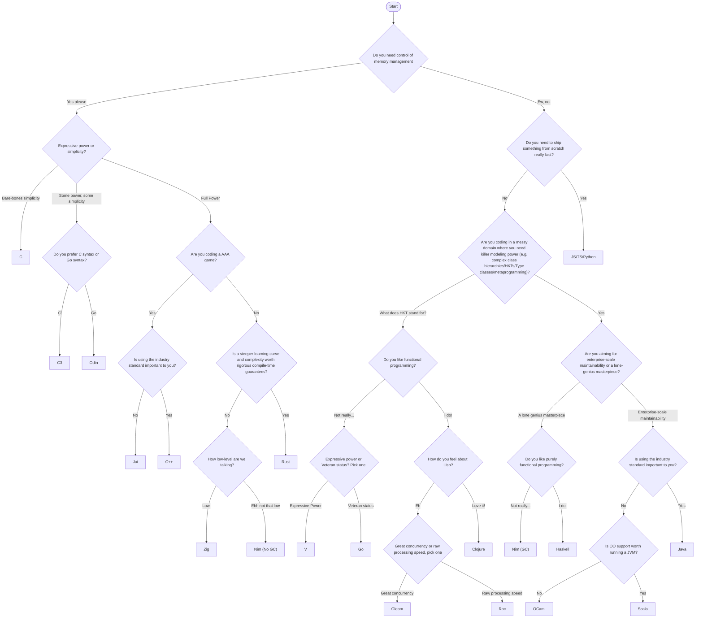

I've spent that last few months playing around with different back-end programming languages.

When I was newer to programming, I thought that the most important attributes of a programming languages lied in its syntax. I would say that I liked Python more than Java because I didn't have to write curly braces, or because the ternary conditional operator felt more readable.

Later on, after programming for some years, I started realizing that there's a lot more depth to programming languages. There are many topics and concepts to discuss when comparing programming languages, that are much more interesting than: "hey, does this language require semicolons?"

Because language syntax is much easier to see and understand than language semantics, a lot of internet discussion about a programming language will revolve around silly syntax stuff. These discussions miss the point of what, I think, newer programming languages should try to do if they want to be successful — offer a unique combination of features that fills an unmet need.

The languages I've been playing with do precisely this. They are the result of a very specific vision to fill a very specific need. These needs can be so specific though, that sometimes it can be hard to differentiate between the use-case for one language and another. For example, Rust and Zig are both newer systems languages that offer excellent modern tooling and advanced meta-programming capabilities. Without delving deeper, it can be hard to see when it would make more sense to choose one over the other.

To remember the use-cases for each language I've played around with, I created this decision flowchart. I'm posting it here because I figured it might be useful to other people.

Some caveats:

- This flowchart isn't meant to be an "end-all be-all" tool to pick a programming language for any use-case, for any person. That would be a pretty massive chart. This flowchart is made for people who are:
  - Not necessarily optimizing for a popular language. Instead, optimizing for technically "the right tool for the job".
  - Building a project, as opposed to writing a script or solving an algorithmic problem.
  - Aiming for a general purpose language.
  - Specifically targeting a computer or server environment, not embedded, mobile, or front-end.
- This flowchart ignores domain-specific cases where one language is the de-facto standard. Like for example, in competitive programming C++ is the standard. But, that's not mentioned here.
- If you're not optimizing to necessarily use the right tool for the job, and instead are optimizing for fun and learning, ignore this chart! Choosing a technology solely for fun/learning can be a valid use-case.

