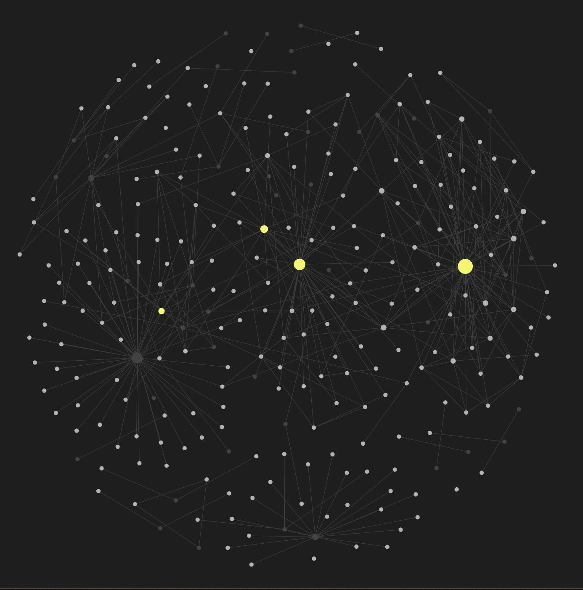

I like writing, I don't love it. But, [for different reasons](/posts/why-i-write/), I've been writing notes for myself since around 2018. I thought I'd share how I originally used to write, and how that has changed over the years. I thought some people might find it useful or interesting.

## Different writing systems I tried

For many years, I struggled with a system that I liked. I originally wrote using pen-and-paper. But, I didn't like this experience — it hurt my had after a while; I was very slow at it; my writing was often illegible; and, my notes were not easily searchable.

So, I eventually transitioned to writing notes in Markdown files on my computer[^1]. This definitely felt like a big step up from my pen-and-paper notes. But, it still felt like something was missing.

My Markdown notes were searchable, but I still had difficulty finding notes. Sometimes, I would spend a long time writing about a novel good idea, only to find that months ago, I had already written about the exact same idea. In these cases, I would have much preferred to realize that there had already been a note talking about a concept, so that I could expand on it, instead of essentially re-writing it.

Also, sometimes I would create two notes that were related. But, I had no system where I could put some metadata on both notes that would indicate that they should be linked together.

I tried grouping notes into folders, where each folder represented a topic, but this only partially solved the problem. Some notes didn't seem to belong to any one folder because they touched upon multiple topics.

## Enter Zettelkasten

After discussing with a friend, he suggested I try using a [Zettelkasten](https://zettelkasten.de/introduction/) system. I did some research on the concept and this system felt like a good fit. In broad strokes, a Zettelkasten is a way to write notes where each note holds at most one concept, and you have some method of linking notes together. This system essentially enables you to create a conceptual graph, where each note is a vertex, and each connection between two notes is an edge.

I've been using this system now for a few years and I'm pretty happy with it. Now that each note is one concept in my graph, it is much easier for me to navigate my notes. It's also much easier for me to find out whether I'd previously written about something. In cases where a concept that I was ready to write about already exists in my graph, I simply pivot to expand on that concept in a new note and then link both notes together.

Also, I don't have to worry about folders anymore. All of my notes are all located in the same directory. If I ever want to see the notes that deal with a certain topic, I can use software to show me all the notes that are linked to that topic. If a note touches on multiple topics, I can just create one link from that note to each topic that it deals with.

The software that I use to see my graph and the notes related to a certain topic is [Obsidian](https://obsidian.md/). In Obsidian, if you're writing in a markdown file and want to link some text to another markdown file, all you have to do is wrap the text in double brackets, and insert the path to the other markdown file:

```md
Here, I am linking to [[./path-to-other-note.md|another note]].
```

This is what my graph looks like on Obsidian:



Here, each white node is a note. And, each dark-gray node is a topic. The big yellow nodes are just topics that I've written a lot about[^2].

## The Zettelkasten rabbit-hole

If the Zettelkasten system sounds interesting to you, I encourage you to try it out for yourself. However, I also encourage you to try to gauge how far you want to go down the rabbit-hole. This is because there's about a million different ways you can create and configure one.

A Google search for "Zettelkasten" will show you a sea of different websites/creators/products offering their own definitions and implementation recommendations. Some people follow a technical specification of a Zettelkasten system religiously. Other people only implement the parts they like. Some people use physical cards and link them together by using metadata on the back of those cards. Other people use software like [The Archive](https://zettelkasten.de/the-archive/), [Obsidian](https://obsidian.md/), [Roam Research](https://roamresearch.com/), [Org-roam (for Emacs)](https://www.orgroam.com/), [vimwiki](https://github.com/vimwiki/vimwiki), etc.

Because of all the different ways one can create a Zettelkasten, one might fall victim to the paradox of choice, where one spends a disproportionately large amount of time trying to find the "right" one.

For some people, choosing the "best" Zettelkasten approach for them can be fun. For those people, the time and effort they invest into optimizing their writing workflow is well-spent. Just as well-spent as, you know, *actually doing the writing*.

But, I'm not one of those people. I gauged that I only wanted a simple and small Zettelkasten system so I only did simple and small research to set up my own system and get just enough of my needs met. Nothing more.

If you want to get started, I encourage you to also gauge how deep you want to go before settling on a system and getting to writing. It can be easy to accidentally go too deep.

I personally [used this video](https://www.youtube.com/watch?v=E6ySG7xYgjY) to get started.

[^1]: I chose to write notes in Markdown files for two reasons. One, I wanted to avoid vendor lock-in where my notes were only usable in one product. If that product were to become deprecated, I would be forced to migrate off. And, that would suck. Especially because some products make it near impossible to export all of your work in a format that is equivalently useful in another platform. Markdown files on the other hand are natively software-agnostic. So, I could edit them in VSCode or Vim or Notepad++ or whatever. Two, I wanted to have version-controlled notes. And, to me it seemed like using git on my file-system would be the best way to to do this.

[^2]: Actually, these are [Maps of Content or MOCs](https://obsidian.rocks/maps-of-content-effortless-organization-for-notes/). Really, this is just a fancy word for a topic that has been written about so much, that it has its own note that serves as an index or "jumping off point" that has links to all the notes that it connects to.
